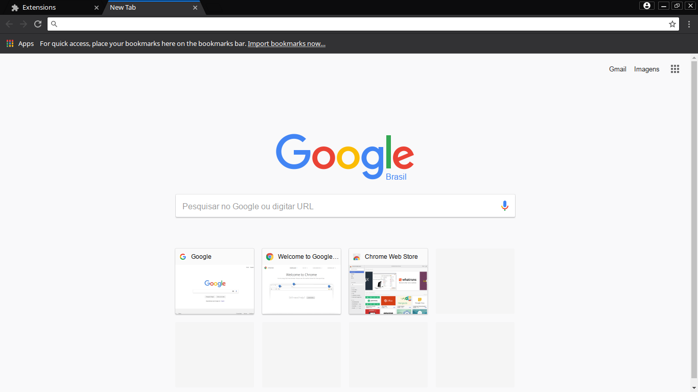

# Chromefox

### A theme for Chrome/Chromium/Iridium to make it look like the new Mozilla Firefox.

Based on [Vertex Theme](https://github.com/horst3180/vertex-theme) and [Material Incognito Dark Theme](https://github.com/Fiddle-N/material-incognito-dark-theme).

## How to use it

A compiled version is provided in the *release* tab.
Download the file **chromefox-theme-v?-r?.crx** from the latest release.
After that, drag and drop the file from your file manager to your browser.
That should do it.

If you want to tweet and play around with it, just download the project.
Just the *manifest.json* file and the *images* folder are really important.
To use the theme open a new tab in your browser with the address *chrome://extensions* and click on *Load unpacked extension...* and select the directory with the theme files.
